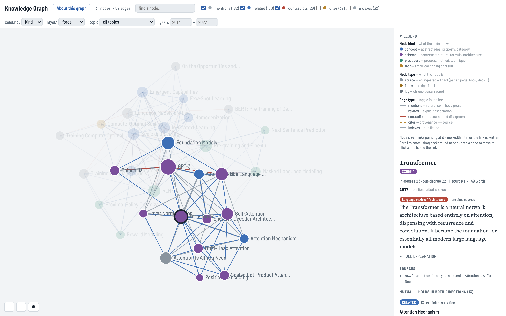
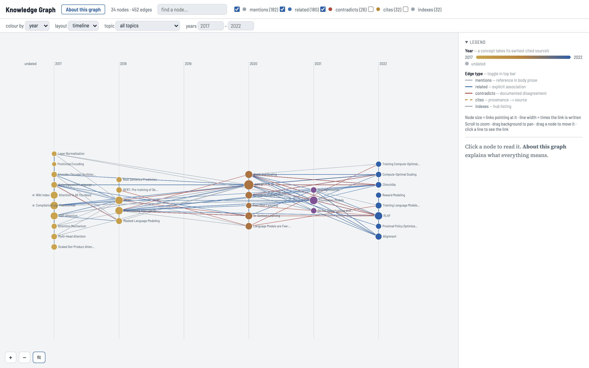
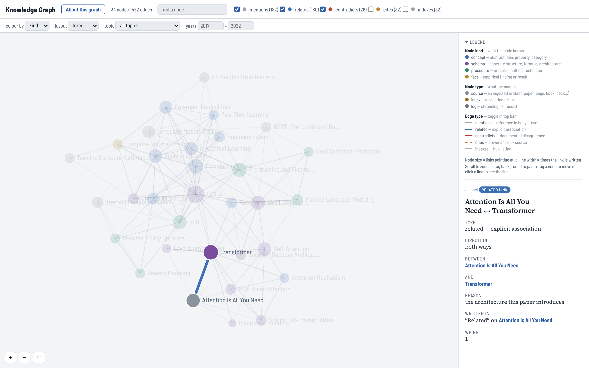

<p align="center">
  
</p>

<h1 align="center">wiki-to-graph</h1>

<p align="center">
  <a href="https://pypi.org/project/wiki-to-graph/"></a>
  
  
  
  
  
</p>

Turn an **LLM wiki** — a folder of interlinked markdown pages (the ["LLM wiki"
pattern by Andrej Karpathy](https://datasciencedojo.com/blog/llm-wiki-tutorial/)) —
into a real **knowledge graph**: typed nodes and edges you can validate, analyze, traverse, query,
update, and view in a browser. Python 3 only; no other dependencies.

The insight: an LLM wiki is *already* a graph — pages are nodes, `[[wiki-links]]` are edges. Each
page's consistent sections tell you what *kind* of edge each link is (a link under `## Related` is a
`related` edge; one under `## Contradictions` is `contradicts`). This tool makes that graph explicit.

**It works on a wiki in whatever shape it is in.** A README standing in for the index, `**Type:**`
lines instead of frontmatter, papers written up as pages, every disagreement on one hub page, no
Sources sections — `build` normalizes a copy before parsing, so the same content produces the same
graph however it was written. Your files are never modified.

<picture>
  <source media="(prefers-color-scheme: dark)" srcset="assets/graph-viewer-dark.png">
  
</picture>

*The included viewer, opened at `graph-viewer.html#Transformer`, in light or dark to match your system.
Nodes are coloured by kind and edges by type; the side panel shows the selected page's summary, sources
and relationships, each with the reason it was made. **About this graph** explains all of it using the
graph's own counts.*

**Working with the graph through Claude rather than code?** Read the
[**User Guide**](docs/user-guide.md): what is in the graph, how to read the viewer, what to ask, and
how to change it.

---

## Install

**Easiest: give your agent this repository's link and tell it to install.**

> Install https://github.com/vanderbilt-ms-ai/wiki-to-graph

Agents follow [`INSTALL.md`](INSTALL.md), which picks the right method for their environment and
checks that it worked. Or install it yourself:

| Method | Commands | You get |
|---|---|---|
| **Claude Code plugin** | `claude plugin marketplace add vanderbilt-ms-ai/wiki-to-graph`<br>`claude plugin install wiki-to-graph@wiki-to-graph` | the three skills, loaded in your next session. Inside a session, use `/plugin marketplace add …` and `/plugin install …` |
| **Clone** | `git clone https://github.com/vanderbilt-ms-ai/wiki-to-graph.git` | everything: scripts, skills, example, tests. Nothing to install |
| **pip** | `pip install wiki-to-graph` | the `wiki-to-graph` and `wiki-to-graph-viewer` commands |

Requirements: Python 3.8+, standard library only. `networkx` / `scipy` are optional, for your own
heavier analysis. For changes newer than the latest release:
`pip install git+https://github.com/vanderbilt-ms-ai/wiki-to-graph.git`.

Once installed, tell your agent: *"Turn my wiki at `<path>` into a graph."* No reformatting first.

The plugin ships **three skills**, one per stage:

| Skill | Use when |
|---|---|
| `wiki-to-graph` | you have a wiki — build it into a graph and view it |
| `wiki-author` | you have source material and no wiki yet |
| `wiki-graph-maintain` | you have a graph — ingest new sources, keep it healthy |

---

## This is a Claude plugin

```
wiki-to-graph/                      ← plugin root (also a one-plugin marketplace)
├── .claude-plugin/
│   ├── plugin.json                 ← plugin manifest
│   └── marketplace.json            ← lets the repo be added as a marketplace
├── skills/
│   ├── wiki-to-graph/
│   │   ├── SKILL.md                ← build/validate/analyze/query/update/view
│   │   ├── references/spec.md      ← full ontology + format spec
│   │   └── scripts/
│   │       ├── wiki_to_graph.py        ← the toolkit
│   │       ├── wiki_normalize.py       ← adapts any wiki shape to the page contract
│   │       └── build_graph_viewer.py   ← HTML graph viewer generator
│   ├── wiki-graph-maintain/
│   │   └── SKILL.md                ← keeping a graph correct as it grows
│   └── wiki-author/
│       └── SKILL.md                ← writing a wiki that graphs cleanly
├── examples/
│   ├── llm-wiki/                   ← the runnable example wiki (source of build/)
│   │   ├── wiki/                   ← 34 pages: 26 concepts, 6 sources, index, log
│   │   └── raw/                    ← 6 source papers the pages cite
│   └── vocab.custom.json           ← a custom kind/edge vocabulary for --vocab
├── tests/                          ← proves any wiki shape builds the same graph
├── build/                          ← sample outputs, regenerated from examples/llm-wiki/wiki
├── docs/
│   ├── user-guide.md               ← using the graph through a Claude conversation
│   ├── outputs-and-workflows.md    ← what each build object is + example workflows
│   ├── custom-vocabulary.md        ← --vocab format, and the orphan trap it avoids
│   └── publishing.md               ← distribution + release steps
├── pyproject.toml
├── assets/graph-viewer-*.png
├── INSTALL.md                      ← install steps an agent can follow
├── AGENTS.md                       ← pointers for agents working in this repo
├── LICENSE.md
└── README.md
```

**Runnable example included.** `examples/llm-wiki/` is the exact wiki the
committed `build/` artifacts were generated from, so the whole pipeline runs
from a fresh clone. New here? Start with
[`docs/outputs-and-workflows.md`](docs/outputs-and-workflows.md).

---

## Quick start

Paths below are from a clone of this repo (`SCR=skills/wiki-to-graph/scripts`). After a pip install, use
`wiki-to-graph` in place of `python3 skills/wiki-to-graph/scripts/wiki_to_graph.py`, and
`wiki-to-graph-viewer` in place of `build_graph_viewer.py`.

### 1 · Build the graph

```bash
python3 skills/wiki-to-graph/scripts/wiki_to_graph.py build examples/llm-wiki/wiki \
        -o build/graph.json --emit sqlite,graphml
```

Writes **`build/graph.json`** (canonical), plus `graph.db` (SQLite) and `graph.graphml` (Gephi/yEd).
Add `--kst` for a `domain.json` KST projection.

`build` first normalizes a copy of the wiki and prints what it adapted on a `normalized:` line —
for this example, nothing, because it is already in the page contract. `--emit-normalized DIR`
keeps the normalized copy; `--no-normalize` parses the wiki exactly as written.

### 2 · Validate

```bash
python3 skills/wiki-to-graph/scripts/wiki_to_graph.py validate build/graph.json
```

Broken links / orphans / self-loops fail (exit 1). Cross-reference cycles are informational.

Optional: `wiki_to_graph.py lint <wiki>` lists what build will normalize plus content notes only an
author can supply, such as a link given no reason. It never blocks a build.

### 3 · Analyze

```bash
python3 skills/wiki-to-graph/scripts/wiki_to_graph.py analyze build/graph.json --top 5
```

PageRank, in-degree, most-contested nodes, components, communities. Shortest path:
`--path "GPT-3" "Layer Normalization"`.

### 4 · Query (no SQL needed)

```bash
SCR=skills/wiki-to-graph/scripts/wiki_to_graph.py
python3 $SCR query build/graph.json node "RLHF"            # details + edges
python3 $SCR query build/graph.json neighbors "GPT-3"      # outgoing
python3 $SCR query build/graph.json backlinks "Transformer"# incoming
python3 $SCR query build/graph.json contradicts            # all tension pairs
python3 $SCR query build/graph.json unexplained            # typed links with no stated reason
python3 $SCR query build/graph.json bfs "Transformer" --edges related
python3 $SCR query build/graph.json dfs "GPT-3" --edges contradicts --undirected
python3 $SCR query build/graph.json path "Positional Encoding" "RLHF"
python3 $SCR query build/graph.json topics                 # topics, with source/concept counts and years
python3 $SCR query build/graph.json timeline --node-type source
python3 $SCR query build/graph.json bridges                # links between pages sharing no topic
python3 $SCR query build/graph.json lineage "A" "B"        # citation chains: A cites … cites B
```

**Filter any traversal** on edge type, node type/kind, or a combination — include or exclude:

| flag | effect |
|------|--------|
| `--edges a,b` | traverse/show ONLY these edge types |
| `--ignore-edges x,y` | all edge types EXCEPT these |
| `--kind a,b` | visit ONLY these node kinds (`concept/schema/procedure/fact`) |
| `--ignore-kind x,y` | all kinds EXCEPT these |
| `--node-type …` / `--ignore-node-type …` | filter structural type (`concept/source/index/log`) |
| `--topic "Field / Topic"` | ONLY pages in these topics; a field matches every topic under it |
| `--years 2020-2023` | ONLY pages dated in range (`2020`, `2020-`, `-2020` also work) |
| `--undirected` | treat edges as undirected in bfs/dfs |

### 5 · Update the wiki, then rebuild

The graph is derived; edit the source markdown and re-run `build`.

```bash
W=examples/llm-wiki/wiki

# add knowledge atoms and the artifacts they came from
python3 $SCR update $W add-node   --title "Mixture of Experts" --kind schema --summary "…"
python3 $SCR update $W add-source --title "Switch Transformer" --locator "arxiv:2101.03961" \
                                  --date 2021-01 --topics "Language models / Scaling"
python3 $SCR update $W set-topics --node "GPT-3" --topics "Language models / Scaling"

# link them (cites writes the target's locator, so it resolves onto the source page)
python3 $SCR update $W add-edge   --from "Mixture of Experts" --to "Transformer" --type related
python3 $SCR update $W add-edge   --from "Mixture of Experts" --to "Switch Transformer" --type cites

# reshape (independent examples)
python3 $SCR update $W set-kind    --node "GPT-3" --kind schema
python3 $SCR update $W rename      --node "GPT-3" --title "GPT-3 (Brown et al., 2020)"
python3 $SCR update $W remove-edge --from "Mixture of Experts" --to "Transformer" --type related
python3 $SCR update $W remove-node --node "Mixture of Experts"

# a page authored as a concept that is really an artifact: retype it
# (set-type drops `kind`, since only concepts carry one)
python3 $SCR update $W set-type    --node "Chinchilla" --type source
```

`rename` rewrites inbound `[[links]]` across the wiki. `remove-node` names every page that will
dangle as a result, with the command to fix each. Maintaining a graph over time — ingesting a new
artifact, deduping against what already exists, health checks — is the **`wiki-graph-maintain`**
skill.

### 6 · View in a browser

```bash
python3 skills/wiki-to-graph/scripts/build_graph_viewer.py build/graph.json -o build/graph-viewer.html
```

Double-click `build/graph-viewer.html`. It is one self-contained file: the fonts are embedded and it
makes no network requests. It follows your system's light or dark setting, and on first visit
**About this graph** explains nodes, edges, sizes, topics and years using this graph's own counts.

Scroll to zoom, drag the background to pan, drag a node to reposition it, `fit` to reframe. Click a node
for its summary, full explanation, sources, and its outgoing edges and backlinks — **grouped by edge
type, each showing the reason the link was made**, with `← back` to retrace. Click an edge for its
type, its direction and the reason written for it. Add a node's title to the URL —
`graph-viewer.html#Transformer` — to open with that node selected. Colours and toggles are derived
from the graph, so a custom `--vocab` renders correctly without touching the viewer. When pages carry
years or topics, a second bar colours nodes by topic, field or year, filters by topic and year range,
and switches to a **timeline** layout that places each page at its year.

<picture>
  <source media="(prefers-color-scheme: dark)" srcset="assets/graph-viewer-timeline-dark.png">
  
</picture>

*Timeline layout, coloured by year: each page sits at its year, and a link reaching left points back in time.*

<picture>
  <source media="(prefers-color-scheme: dark)" srcset="assets/graph-viewer-edge-dark.png">
  
</picture>

*A selected edge: its type, its direction, and the reason written for it on the page that makes it.*

---

## The model in 30 seconds

- **Nodes** have a structural `type` (`concept`, `source`, `index`, `log`), set per page via
  frontmatter `type:`. Concepts *also* carry a knowledge `kind` — **concept / schema / procedure /
  fact** — via frontmatter `kind:`.
- **The two axes are independent.** `type` is what a node *is*; `kind` is what a concept *knows*.
  A paper is **not** a `fact` — it *contains* facts. It is a `source`, and the claims drawn from it
  are `fact` atoms that `cites` it.
- **A source is any ingested artifact**, not just a paper: give it a `locator` (a file path, a
  URL, or a `doi:` / `arxiv:` / `isbn:` / `issn:` / `urn:` / `hdl:` identifier) and `medium` is
  inferred — paper, web, book, slides, video, transcript, notebook, code, data, audio, note.
- **Edges** are typed by their source section: `mentions`, `related`, `contradicts`, `cites`, plus
  `indexes` / `records` from the index/log hub pages.
- **Years and topics** place pages in time and subject. A source's `year` comes from `date:`, a title
  ending "(Author, 2017)", or a filename like `smith-2017-x`; `topics:` ("Field / Topic", comma
  separated) can go on any page. Concepts that state neither inherit their cited sources' most
  shared topic and earliest year, marked as derived.
- Each node carries its own `edges` list, degrees, `word_count`, `n_sources`, `aliases`. Link text
  is stored as plain names — the relationship lives in the edge, not in `[[markup]]`.
- **Every edge carries `context`** — the bullet or sentence the link was written in, which is where
  the author said *why* the two are connected. An empty `context` means the link was never given a
  reason: `query unexplained` lists those.
- In a typed section, a bullet's **leading link is the relation**; links inside its prose are
  evidence and become `mentions`. `- [[A]] — because [[P]] found X` does not mean this page
  disagrees with P.

Full details: `skills/wiki-to-graph/references/spec.md`.

## Use on your own wiki

Point `build` at it. No reformatting first:

```bash
python3 skills/wiki-to-graph/scripts/wiki_to_graph.py build path/to/your/wiki -o build/graph.json
python3 skills/wiki-to-graph/scripts/build_graph_viewer.py build/graph.json -o build/graph-viewer.html
```

What `build` adapts automatically:

| Your wiki has | `build` does |
|---|---|
| `README.md` and no `index.md` | treats it as the index |
| `**Type:** X` lines instead of frontmatter | derives each page's `kind` from them |
| pages describing papers, books, videos, sites or decks | makes them `source` nodes, locator included |
| no `## Sources` sections | lists the source pages each concept links to |
| one contradictions page of `### item` / `- [[side]]: claim` | records each disagreement on the pages that disagree |
| `## See also`, `## Tensions`, `## References` | reads them as Related, Contradictions, Sources |
| `- [[A]] — because [[P]] found X` | a relation to A, with P as evidence rather than a second relation |
| `None across the sources — see [[A]]` | no disagreement |

**Different ontology?** `--vocab vocab.json` supplies your own `kinds` / `concept_edges` /
`symmetric` / `hub_edges` — see [`docs/custom-vocabulary.md`](docs/custom-vocabulary.md). Unusual
section names beyond the built-in synonyms: `--map map.json`. Use the two together: a custom
`--map` without a matching `--vocab` builds a graph in which every node reports as an orphan.

## Tests

```bash
python3 -m unittest discover tests
```

The suite renders the bundled example in other common wiki shapes — kebab-case files with a
README hub and `**Type:**` lines, an Obsidian-style vault, and a single contradictions hub — and
asserts every one builds the same nodes and typed edges as the original.

## License

Licensed under [Creative Commons Attribution-NonCommercial-ShareAlike 4.0
International (CC BY-NC-SA 4.0)](https://creativecommons.org/licenses/by-nc-sa/4.0/).
Free to use, share, and adapt for **non-commercial** purposes, with attribution,
under the same license. Commercial use is not permitted under this license.

**Commercial users should inquire for use:** contact **tim.darrah@mangrove.ai**.

Full terms in [`LICENSE.md`](LICENSE.md).

## Status & limits

Working end-to-end: build → validate → analyze → query → update → view. Deliberately simple and
static — the graph is recomputed from the markdown on every `build` (no incremental updates). Edge
`weight` is captured but inert (not used by metrics). No external ontology is imposed, but `--vocab`
lets you supply one (`examples/vocab.custom.json` carries a Biolink-style relation hierarchy).

## Acknowledgements

- The **"LLM wiki" pattern** is due to **Andrej Karpathy**.
- The bundled example (`examples/llm-wiki/`) follows Data Science Dojo's tutorial,
  [*The LLM Wiki Pattern by Andrej Karpathy: A Step-by-Step Tutorial to Building a
  Compounding Knowledge Base*](https://datasciencedojo.com/blog/llm-wiki-tutorial/),
  and is compiled from six foundational AI papers (Attention Is All You Need, BERT,
  GPT-3, Foundation Models, RLHF/InstructGPT, Chinchilla).
